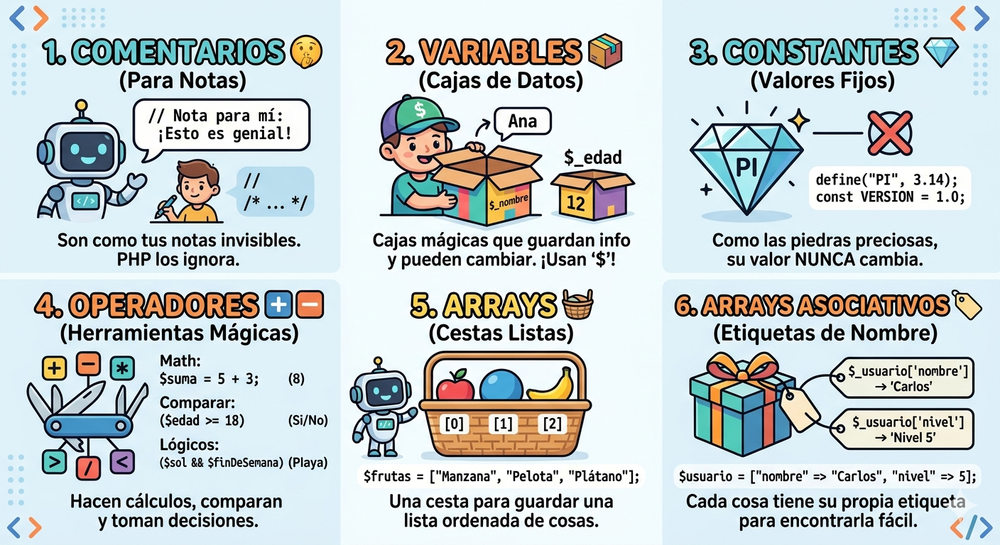

# intro_php

# Introducción a PHP: Comentarios

Los comentarios en PHP son secciones de texto que el intérprete ignora. Su propósito principal es documentar la lógica del código para humanos y facilitar el mantenimiento.

## 📌 Tipos de Comentarios

### 1. Comentarios de una sola línea
Se utilizan para notas breves o para deshabilitar una instrucción específica.
**Sintaxis C++:** // (Es el más utilizado).
**Sintaxis Shell (Hash):** # (Menos frecuente).
php
// Esto es un comentario de una sola línea
$edad = 25; # También se puede usar la almohadilla

/*
  Este es un bloque de comentario.
  Es útil para explicar algoritmos complejos
  o documentar la autoría del archivo.
*/
 

### 📊 Resumen de Comentarios en PHP

| Tipo | Sintaxis | Uso Principal | Ejemplo |
| :--- | :--- | :--- | :--- |
| **Línea única** | // | Notas breves y aclaraciones rápidas. | // Definir tasa |
| **Estilo Shell** | # | Comentarios cortos (estilo Python/Bash). | # Variable ID |
| **Multilínea** | /* ... */ | Explicaciones largas o anular bloques. | /* Notas... */ |
| **DocBlock** | /** ... */ | Documentación técnica y estándares. | /** @param... */ |

#  Introducción a PHP: Variables

Las variables en PHP se utilizan para almacenar datos que pueden cambiar durante la ejecución del script. A diferencia de otros lenguajes, PHP es de **tipado débil**, lo que significa que no necesitas declarar el tipo de dato manualmente.

## 📌 Reglas de las Variables

Para que una variable sea válida en PHP, debe seguir estas reglas:
1. **El signo $企:** Todas las variables deben comenzar con el símbolo de dólar $.
2. **Nombres válidos:** Deben empezar con una letra o un guion bajo (_), nunca con un número.
3. **Sensibilidad a mayúsculas:** $miVariable y $mivariable son dos variables distintas (**Case-sensitive**).
4. **Asignación:** Se utiliza el operador = para asignar un valor.

## 📊 Resumen de Tipos de Datos y Sintaxis

| Concepto | Regla / Sintaxis | Ejemplo |
| :--- | :--- | :--- |
| **Declaración** | Siempre inicia con $ | $nombre = "Ana"; |
| **Enteros (int)** | Números sin decimales | $puntos = 100; |
| **Flotantes (float)** | Números con decimales | $precio = 19.99; |
| **Booleanos** | Valores de verdad | $es_valido = true; |
| **Cadenas (string)**| Texto entre comillas | $saludo = 'Hola'; |

---

**Tipado Dinámico:** Menciona que puedes cambiar el tipo de una variable sobre la marcha. Una variable puede empezar siendo un número $x = 5; y luego pasar a ser texto $x = "cinco"; sin errores.
**Concatenación:** Para unir variables con texto se usa el punto (.), no el signo +. 
    * Ejemplo: echo "Hola " . $nombre;
**Comillas Dobles vs Simples:** * " " (Dobles): PHP procesa las variables dentro del texto.
    * ' ' (Simples): PHP trata todo como texto literal.

    # Conceptos Básicos de PHP: Constantes y Operadores

Este documento contiene una guía rápida sobre el uso de constantes y operadores en PHP, orientada a principiantes.

---

## 1. Constantes en PHP
Las constantes son identificadores para valores sencillos que **no pueden cambiar** durante la ejecución del script.

### Características
No llevan el signo $ al principio.
Se definen una sola vez.
Por convención, se escriben siempre en **MAYÚSCULAS**.

### Cómo definirlas
Se pueden definir de dos formas:

1.  **Usando define():** Ideal para definiciones globales.
   
php
    define("PI", 3.1416);
    echo PI;
   
2.  **Usando const:** Más común dentro de clases o scripts modernos.
   
php
    const APP_VERSION = "2.5.0";
   

php

<?php
    const LIMITE_EDAD = 18;
    $edadUsuario = 20;

    if ($edadUsuario >= LIMITE_EDAD) {
        echo "Acceso concedido.";
    } else {
        echo "Acceso denegado.";
    }
?>

## 3. 📊 Arrays y Arrays Asociativos
Estructuras versátiles que almacenan pares **clave-valor**.

### Tipos de Arrays:
**Indexado:** Usa índices numéricos automáticos 
(0, 1, 2...).
 
php
  $frutas = ["Manzana", "Pera"];

   Asociativo: Usa claves personalizadas para mayor claridad.
PHP
$usuario = ["nombre" => "Ana", "edad" => 30];

1. Operadores AritméticosSe usan con valores numéricos para realizar operaciones matemáticas comunes.OperadorNombreEjemploResultado+Suma$a + $bSuma de $a$ y $b$-Resta$a - $bDiferencia entre $a$ y $b$*Multiplicación$a * $bProducto de $a$ y $b$/División$a / $bCociente de $a$ y $b$%Módulo$a % $bResto de la división**Exponenciación$a ** $b$a$ elevado a la potencia $b$2. Operadores de AsignaciónEl más básico es =, que asigna el valor de la derecha a la variable de la izquierda. Sin embargo, existen atajos:$x += $y: Equivalente a $x = $x + $y$x -= $y: Equivalente a $x = $x - $y$x *= $y: Equivalente a $x = $x * $y3. Operadores de ComparaciónEstos son fundamentales para las estructuras de control (como los if). Devuelven un valor booleano (true o false).Igualdad (==): Retorna cierto si los valores son iguales.Identidad (===): Retorna cierto si los valores son iguales y del mismo tipo.Diferente (!= o <>): Cierto si los valores no son iguales.Mayor que (>) y Menor que (<).Nave espacial (<=>): (Introducido en PHP 7) Retorna -1, 0 o 1 dependiendo de si el valor de la izquierda es menor, igual o mayor que el de la derecha.Nota rápida: Siempre que puedas, usa el comparador de identidad (===). Te ahorrará muchos dolores de cabeza con tipos de datos inesperados.4. Operadores LógicosSirven para combinar sentencias condicionales.and o &&: Cierto si tanto $A$ como $B$ son ciertos.or o ||: Cierto si al menos uno es cierto.! (Not): Invierte el valor (si es cierto, pasa a ser falso).5. Operadores de String (Cadenas)PHP tiene dos operadores diseñados específicamente para strings:Concatenación (. ): Une dos cadenas.PHP

$a = "Hola ";
$b = $a . "Mundo"; // Resultado: "Hola Mundo"
